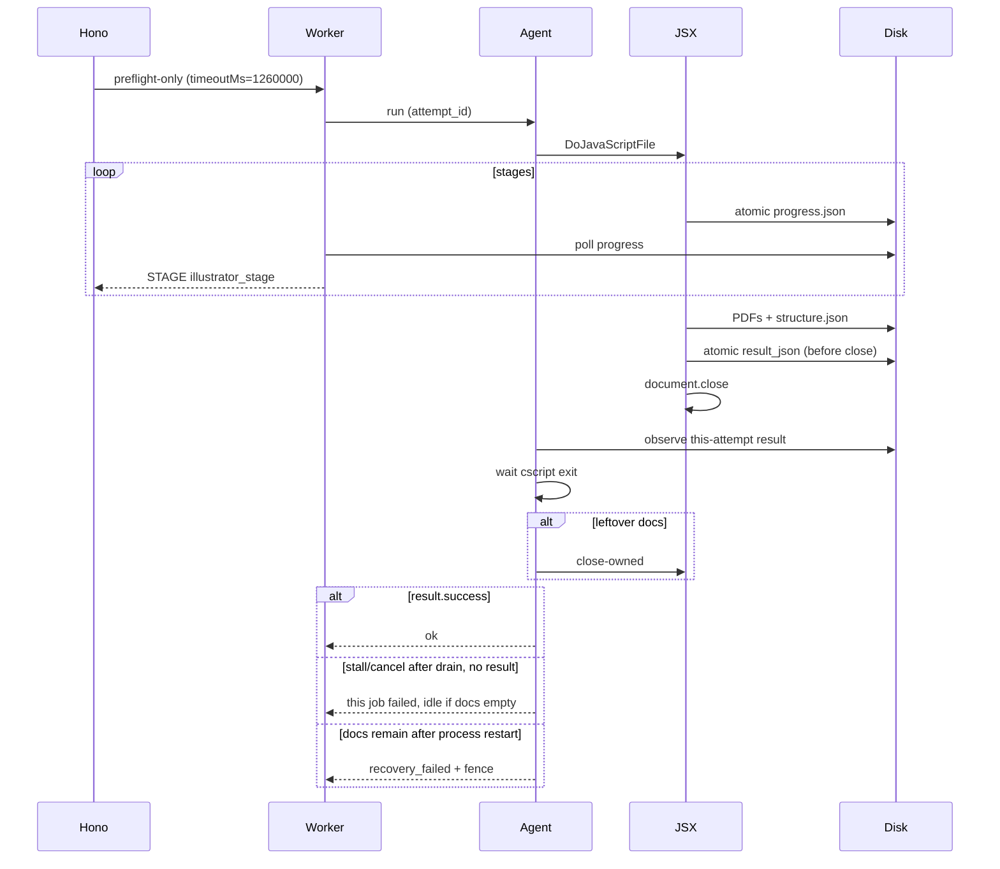

# 工程计划：Illustrator 无人值守控制面

日期：2026-09-03  
仓库：weiweity/beian  
状态：CONSTRUCTION（`/plan-eng-review` FULL_REVIEW，D1–D18 已锁）  
生产：杭州 `DESKTOP-FAEJK8S`，Illustrator 2026 30.5.1，Session 1 Agent  
HEAD：`edb2259`（`0.21.20.0`）  
本文件是 `/plan-eng-review` 锁定后的施工计划。

本楔换监督模型。不在 390 秒、围栏、自动拆锁上打补丁。同一台机仍然单槽。没有无 GUI 的 Illustrator Server。Mac 隔离 worktree `/ship`，禁止杭州 `/ship`。

## Problem

打样台把交互式 Illustrator 当工人，却用「到点杀掉 COM」当完工信号。

杭州 2026-09-03 现场（`9ed677e949f7`，转曲 C 译龄 DNA 眼膜花盒 26H21A）：

| 项 | 事实 |
|---|---|
| 稿 | 21.5 MB，专色/刀版/标注多层 |
| 轻稿对照 | `8261b8e3cee3` 同分钟 15 秒过 |
| 开工 | 02:42:59Z |
| 代理杀 cscript | 02:49:29Z，正好 390s（Hono 420 − 30） |
| JSX 仍在写 | 02:50:06 `v2 03 saving isolated artwork pdf`，无 `V2 ERROR` |
| 产物 | 02:50:07 `structure.json` / `illustrator_result.json`，`success: true` |
| 作业文案 | Illustrator 处理超时，请确认桌面没有弹窗后重试 |
| 同一秒 | `illustrator_recovery_failed` 写入围栏 |
| 之后 | 所有新单/重试约 0.4 秒 412；health `queued=0` 是没排上，不是队列很长 |

不是「队列堆了很多单在跑」。是一张重稿被杀掉 → 关不掉还在存 PDF 的文档 → 围栏锁死全厂。

`run_export.vbs:86` 的 `DoJavaScriptFile` 不可中断。Kill cscript 停不掉 Illustrator 内部的 `savePdf`。完工信号必须是本代产物文件，不是墙钟。

## Why not patch

- 把 390 改成 600。更重的稿仍会在存盘时被杀。
- 超时后不把 `recovery_failed` 写成围栏，但仍 Kill cscript。仍可能留下半截 PDF 和开着的稿。
- 桌面进程已空时自动拆围栏。对「Illustrator 还在 PID 23060」的现场无效。
- 同一会话多开几个 `Illustrator.exe`。`GetObject` 仍接到一个 Application，`Documents.Count` 必须为 0。

## Sources（至少两处独立来源）

- Adobe Illustrator Scripting Guide, User-interaction levels：https://ai-scripting.docsforadobe.dev/scripting/userInteractionLevels/
- Adobe Help，Install and run scripts：https://helpx.adobe.com/illustrator/desktop/automate-visualize-data/automate-actions/install-and-run-scripts.html
- Adobe Community Expert Manan Joshi，2025-09（无 Illustrator Server）：https://community.adobe.com/questions-652/is-there-an-api-to-run-illustrator-jsx-scripts-automatically-817225
- Mapsoft 无人值守批次：https://mapsoft.com/posts/illustrator-batch-processing.html
- Adobe 社区长脚本：https://community.adobe.com/questions-652/illustrator-crashes-when-running-script-after-extended-period-of-time-769716
- Preview Off / 少 redraw：https://community.adobe.com/t5/illustrator-discussions/suspend-ui-during-script-execution/td-p/11362997
- `LiveEdit_State_Machine` false：https://gist.github.com/monokano/88f4561632c76195affa4f014b6ba1ef

现有 JSX 已设 `DONTDISPLAYALERTS`。这次主因不是弹窗，是杀存盘。

## Locked decisions

### 施工产品锁（C-D1–C-D12）

| ID | 决定 |
|---|---|
| C-D1 | 完工信号是本代 `illustrator_result.json`（及结构导出时的 `structure.json`），不是 cscript 被 Kill、也不是墙钟到点。 |
| C-D2 | 进度文件由 JSX 在每个阶段覆写。代理只读进度和结果，不把「正在 saving」当成可杀状态。 |
| C-D3 | 禁止在 `saving_full_pdf` / `saving_artwork_pdf` / `writing_result` 期间 Kill cscript 或对文档 `close-owned`。 |
| C-D4 | 墙钟只表示「没有新进度」或「已 cancel_pending」。放弃后先等当前 save 结束，再关文档。 |
| C-D5 | 关文档失败：结束匹配的 Illustrator.exe，再 Ensure 空文档列表。已有本代 `success: true` 仍算这一单导出成功。 |
| C-D6 | `illustrator-fault.json` 只在「进程重启后仍有无法证明归属的文档，或 Illustrator 无法再启动」时落下。 |
| C-D7 | 开稿后进入无人值守宿主：`DONTDISPLAYALERTS`、LiveEdit false、Outline/Preview Off。恢复失败只记日志。 |
| C-D8 | 同一 Session 仍单槽。不做第二台杭州机，不改 `live.illustrator` 为并行。 |
| C-D9 | 不把 PDF OCG / 无 Illustrator 的解析器当成结构真值。ADR-005 不变。 |
| C-D10 | 不提交、不保留「桌面空了自动拆围栏」补丁。 |
| C-D11 | 结构阶段不得再写死 120 秒假装预算。中文阶段名走 `STAGE illustrator_<stage>`。 |
| C-D12 | 自动 L1 = 现有 smoke + 15 秒级花盒探活。26H21A 是 land 后杭州人工生产验收，不进 `release.ps1`。未跑 26H21A 不得宣称控制面已换。 |

### 工程审查锁（ER-D1–ER-D18）

| ID | 选择 | 决定 |
|---|---|---|
| ER-D1 | B | 按原文 9+ 文件全做。`run_export.vbs` 不改 COM 语义。 |
| ER-D2 | A | saving 也有 stall；`max_job_seconds=900` 含 saving。 |
| ER-D3 | A | `workers/packaging/illustrator/unattended_host.jsx`，Bind 时内联进 structure 与 legacy。 |
| ER-D4 | A | L0 CRITICAL：progress 停在 `saving_artwork_pdf`、模拟 worker 退出 → 不写围栏、不 Kill cscript、心跳不是 faulted。 |
| ER-D5 | A | 非 saving stall=60s；saving_* stall=300s。 |
| ER-D6 | A | 所有剩余超时天花 ≥ 外层。 |
| ER-D7 | A | 900s = `cancel_pending`，saving 仍不 Kill；排干本次阻塞存盘；外层天花 = 900+300+60 = **1260s**。 |
| ER-D8 | A | 先写 `result_json` 再关稿。Agent 等 cscript 退出，只在还有文档时 close-owned。 |
| ER-D9 | A | `attempt_id` 贯穿 config/progress/result。Agent 只认本代。 |
| ER-D10 | A | progress/result 临时文件替换。空/半截 JSON 当未完成。 |
| ER-D11 | A | 心跳 busy 时调度器不领新 AI 单。busy 不是 offline。 |
| ER-D12 | A | worker 等 Agent 时轮询 progress，去重输出 `STAGE illustrator_<stage>`。 |
| ER-D13 | A | legacy 默认 180s 与 packaging README「7 分钟」一并改到 1260s 合同。 |
| ER-D14 | A | 26H21A 不改 `release.ps1`。 |
| ER-D15 | A | Mac/Windows binder 都内联 host；`job_fingerprint` 加入 helper；四格 L0。 |
| ER-D16 | B | 第二台杭州机不写入 TODOS.md。 |
| ER-D17 | B | 预测 ETA 不写入 TODOS.md。 |
| ER-D18 | B | GameViewer 卸载不写入 TODOS.md。 |

## Wait bounds（名字锁进 L0）

| 名字 | 值 | 含义 |
|---|---|---|
| `stall_seconds`（非 saving） | 60 | `now - updated_at` 超过则 stall |
| `stall_seconds`（`saving_*`） | 300 | 单次阻塞 `savePdf` 的无心跳上限 |
| `max_job_seconds` | 900 | 到点进入 `cancel_pending`，**不是** Kill |
| 存盘排干 | ≤ 300 | `cancel_pending` 之后仍在 saving：等 result 或离开 saving，仍禁止 Kill |
| 外层天花 | **1260s** | Hono `timeoutMs`、named-pipe `timeout_ms` 钳、PS1 `Get-RequestDeadline`、`MOCKUP_TIMEOUT_MS`、pipeline 默认（含 legacy 180）、examples JSON、README |

1260 = 900 + 300 + 60。Hono 杀 Python 必须晚于 Agent 排干。

## Target control plane

```
Hono timeoutMs = 1_260_000（只杀已超过外层的 Python，不按 390s 杀还在 saving 的桥）
  → Worker 边等 Agent 边轮询本单 progress.json
      stderr: STAGE illustrator_<stage>   （去重）
  → Agent 轮询 progress.json + result_json（必须带本代 attempt_id）
      → 半截 JSON / 缺 attempt_id / 旧代：当未完成
      → 本代 result_json 可读：等 cscript 退出，再按需 close-owned
      → 进度 saving_* 且未 stall：禁止 Kill、禁止 close-owned
      → 900s：cancel_pending；若仍在 saving，排干（≤300s），仍禁止 Kill
      → stall 且不在 saving：放弃；等阶段结束再关文档
      → close 失败：结束匹配的 Illustrator.exe → Ensure → document_count==0
      → 重启后仍有不明文档：recovery_failed + 围栏
      → 重启后空文档且本代 success：作业成功，无围栏
```

```
籽烨交 .ai
  → Hono 入队（busy 排队，不 412）
  → 心跳 busy？不 claimAi
  → Agent Bind-RuntimeJsx（内联 unattended_host.jsx + curve_flatten.js）
  → cscript DoJavaScriptFile（不可中断）
  → JSX: open → host(LiveEdit/Outline) → 每阶段原子写 progress
       → savePdf 前先写 saving_* 
       → 产物齐了写本代 result_json
       → 然后 close
  → Agent 见本代 result 且 cscript 退出
  → 页面 STAGE 中文阶段名，无假 120 秒
```



## Contracts

### attempt_id

开工时 pipeline 生成 UUID，写入 `illustrator_input.json`。progress 与 result 必须带回同一字段。Agent 忽略缺字段、不匹配、或开工前已存在的旧文件。同源重试 `source_sha256` 相同也不得吃上一趟 success。

### Progress file

路径：与 `debug_log` 同目录，`illustrator_progress.json`。无 BOM UTF-8。临时文件替换。

```json
{
  "schema": "illustrator-job-progress/1",
  "attempt_id": "<uuid>",
  "stage": "opening|inventory|saving_full_pdf|saving_artwork_pdf|writing_result|closing",
  "updated_at": "<ISO-8601>",
  "source_sha256": "<64 hex>"
}
```

未知 stage 当不在 saving（允许放弃），但 `updated_at` 新鲜时仍禁止 Kill。进入阻塞 `savePdf` **之前**必须先写出对应 saving 阶段。

### Result file

沿用 `illustrator_result.json`，加 `attempt_id`。在 PDFs（及 structure.json）写完之后、`document.close` 之前提交。`finally` 仍必须写（失败路径也写）。空/半截 JSON 当未完成，直到 stall。

若 Kill 发生在本代结果写出之前，视为代理 bug（L0 禁止）。

### Unattended host

新文件 `workers/packaging/illustrator/unattended_host.jsx`，exporter 用 `#include "unattended_host.jsx"`。Bind 时内联，和 `curve_flatten.js` 同一机制。

开稿后、扫图层前：

1. `app.userInteractionLevel = DONTDISPLAYALERTS`（已有）
2. `app.preferences.setBooleanPreference("LiveEdit_State_Machine", false)`
3. Outline / Preview Off：优先 DOM；否则 `executeMenuCommand` 再包一层 DONTDISPLAYALERTS。中文 UI 失败只记 debug，不 fail-closed
4. 不在扫路径循环里 `app.redraw()`

`finally` 尝试恢复 LiveEdit；失败进 `result.host_restore_error`，不失败作业、不写围栏。

### 0.21.22.0 inventory host（已交代码，不是控制面验收）

C-D7 的 LiveEdit / 中文 Outline 失败仍只记日志。下面是盘点性能补丁，**未跑 26H21A 不得宣称控制面已换**：

- 盘点前 hide 顶层、`enterOutlineView` 只按一次 menu `"preview"`，用 `getViewMode` 认 Outline/轮廓，zoom `0.0625`
- 存 PDF 前 `restoreUnattendedArtwork`：任一原可见顶层仍隐藏则抛 `Cannot fully restore artwork layers`，失败走已有印刷层恢复映射
- 关稿 `prepareUnattendedClose`：再 hide + outline + zoom `0.03125`
- `eachInventoryPathItem` 走 `layer.pageItems` 并展开 GroupItem / CompoundPathItem；跳过 表 / 标注 / Dimensions / 尺寸；每层 remainder 上限 512；空的隐藏集合不要把 fallback 从 `document.pathItems` 闩走

### Agent wait（替换绝对 390s Kill）

`Invoke-Cscript` 在 saving_* 且未 stall、或 `cancel_pending` 仍在 saving 时：**不得**走 `$process.Kill()`。`Get-RequestDeadline` 钳到 ≥ 1260000。Python `encode_request` 同样。

busy 心跳：新 worker 必须等，不能 15s 变 `illustrator_agent_offline`。

### Fence / 412

围栏协议仍是 `beian.illustrator.fault.v1`。写入条件仅 C-D6。

`assertIllustratorAgentReady` 只在 `faulted` / 离线时 412。busy 不 412。

`reclaimOnBoot` / `tryStart`：心跳 busy 则不 `claimAi`。当前单 PID 已死但 Agent busy：保持 queued/running，等 idle 或本代 result。不要派第二张 AI 单。

### UI

`jobs.ts` 认 `STAGE illustrator_<stage>`：

| stage | 中文 |
|---|---|
| opening | 打开稿件 |
| inventory | 盘点图层 |
| saving_full_pdf | 保存整页 PDF |
| saving_artwork_pdf | 保存印刷 PDF |
| writing_result | 写出结构 |
| closing | 关闭文档 |

删除结构阶段 `job_eta_s = 120`（`jobs.ts:398` / `:466`）。超时公开句不再暗示「全厂要清围栏」，除非 `last_code` 真是围栏。

## What already exists

| 现成能力 | 本楔怎么用 |
|---|---|
| `DONTDISPLAYALERTS`、`jsx_debug.log` 阶段字 | 保留；进度改走 JSON 合同 |
| `illustrator_result.json` + `finally` 必写 | 改成关稿前写，加 attempt_id，原子替换 |
| `Bind-RuntimeJsx` 内联 `curve_flatten.js` | 扩成 include 表，同时内联 `unattended_host.jsx` |
| named pipe `beian.illustrator.v1`、Session 1 Agent | 等产物，不换协议名 |
| `STAGE structure` stderr | 扩成 `STAGE illustrator_<stage>` |
| 围栏 `beian.illustrator.fault.v1` | 写入条件收窄到 C-D6 |
| L0 静态锁 Agent 源码顺序 | 改断言：Kill 不得出现在 saving 禁杀分支之前；钳 1260000 不是 600000 |
| Hangzhou L1 smoke JSX | 自动 L1 仍只跑这个 + 花盒探活 |

不重建：结构拓扑、ADR-005、Blender、地面阴影、COM 仍在 VBS。

## NOT in scope

- 加长 390/420 作为唯一修复
- 开工板一键 `ClearFaultFence`（Session 0 的 8787 不能清锁）
- 桌面空了自动拆围栏（已撤回）
- 同会话多开 Illustrator 当并行
- 第二台杭州机 / 第二份授权（C-D8，不进 TODOS.md）
- 按字节/图层预测 ETA（会再编假数字）
- GameViewer 卸载、换 Illustrator 大版本、关 HAGS
- 把 26H21A 塞进 `release.ps1`
- 膜袋 3D、浏览器 PPT zip、默认木桌
- 在杭州手工改 `D:\beian` 生产树
- 改 `run_export.vbs` 的 COM 语义

## File ownership

| 文件 | 改什么 |
|---|---|
| `unattended_host.jsx` | **新建**。LiveEdit / Outline / DONTDISPLAYALERTS |
| `export_structure.jsx` | `#include` host；原子 progress/result；attempt_id；**先写 result 再 close**；savePdf 前写 saving_* |
| `export_ai.jsx` | 同一合同 |
| `illustrator-agent.ps1` | 等产物；saving 禁 Kill；cancel_pending+排干；围栏仅 C-D6；Bind 内联 host；deadline ≥1260000 |
| `illustrator_worker.py` | Mac binder 对 legacy 也内联；等 Agent 时轮询 progress 打 STAGE |
| `illustrator_agent.py` | timeout 钳 ≥1260000；busy 不当 offline |
| `workers.ts` | `preflightPackaging` / `runPackaging` `timeoutMs: 1_260_000` |
| `jobs.ts` | MOCKUP_TIMEOUT_MS=1_260_000；STAGE 映射；去掉 120s ETA；busy 不 claimAi |
| `illustratorAgent.ts` | busy 调度语义（ready=true 但调度器不领新单） |
| `pipeline.py` | attempt_id；默认超时（713 与 1037）=1260；fingerprint 加 host |
| `examples/jobs_*.json` | timeout_seconds 对齐 |
| `scripts/windows/README.md` | 监督模型、围栏仅不明文档、禁止杀 saving |
| `workers/packaging/README.md` | 删「7 分钟硬超时」，改为 stall/max_job/outer |
| 测试 | 见下 |
| `run_export.vbs` | **不改** |

不改：`structure_v2`、ADR-005、Blender、`release.ps1`。

## Tests（L0 必须先红后绿）

Mac 无真实 Illustrator COM。文件夹具 + 静态锁源码顺序。不在 L0 开 Adobe。

```
CODE PATHS                                              USER FLOWS
[+] export_structure.jsx / export_ai.jsx                [+] 籽烨交 AI 等出结构
  ├── host after open                                     ├── [GAP] 中文子阶段，无假 120s
  ├── atomic progress per stage                           ├── [GAP] [→E2E] 26H21A land 后人工金标
  ├── result before close + attempt_id                    └── [GAP] 重试不吃上一趟 success
  └── [GAP] torn JSON reader treats as in-progress
[+] illustrator-agent.ps1
  ├── [★★  TESTED] Kill exists in Invoke-Cscript finally  ← 必须改：saving 禁杀
  ├── [GAP] saving_* 禁止 Kill（源码顺序合同）
  ├── [GAP] 合成 10s 刷新 saving_*，墙钟 400s，不 Kill 不围栏
  ├── [GAP] 本代 result success @427s → 作业成功无围栏
  ├── [GAP] CRITICAL worker 退出 + 停在 saving_artwork_pdf
  ├── [GAP] cancel_pending @900s 仍 saving → 不 Kill，排干
  ├── [GAP] stall in opening → 放弃、close-owned、无围栏
  ├── [GAP] close 失败 + 重启后 count=0 + success → 成功无围栏
  ├── [GAP] 重启后仍有文档 → faulted + 围栏
  └── [GAP] 半写 JSON / 旧 attempt_id → 当未完成
[+] Bind-RuntimeJsx / bind_runtime_jsx
  └── [GAP] 四格 Mac/Windows × structure/legacy 内联 host
[+] encode_request / Get-RequestDeadline
  ├── [★★  TESTED] clamp 600_000                          ← 改成 ≥ 1_260_000
  └── [GAP] workers.ts timeoutMs = 1_260_000
[+] jobs.ts / illustratorAgent.ts
  ├── [GAP] busy 不 claimAi，busy 不 412
  └── [GAP] 超时文案不暗示清围栏，除非 last_code 是围栏
[+] pipeline.py
  └── [GAP] legacy 默认不再 180；fingerprint 含 host

COVERAGE: 现约 3/22 与本楔相关路径被旧合同锁住且方向相反
QUALITY: 旧 ★★ 锁的是 Kill-on-timeout，必须先红后绿
GAPS: 19（1 杭州人工金标 [→E2E]，其余 L0）
```

**CRITICAL 回归（ER-D4，无 AUQ 可跳）：** 合成 progress 停在 `saving_artwork_pdf`，模拟 Python worker 退出。断言：不写 `illustrator-fault.json`，cscript 不被 Kill，心跳不是 faulted。

现有 `test_windows_pipe_contract_clamps_timeout_to_agent_bounds` 断言 `600_000`，必须改。现有 `assert "$process.Kill()"` 仍可存在于非 saving 清理，但不得出现在 saving 禁杀分支之前。

## Failure modes

| 路径 | 生产失败 | 测试 | 处理 | 用户看见 |
|---|---|---|---|---|
| 390s Kill during savePdf | 26H21A 已发生 | ER-D4 CRITICAL | 禁 Kill | 不再全厂 412 |
| 900s 仍在 savePdf | DoJavaScriptFile 停不了 | cancel_pending 合成 | 排干不 Kill | 阶段停在保存 PDF |
| 半截 progress | 误 stall | 半写 fixture | 当未完成 | 继续等 |
| 重试吃旧 success | 秒过假成功 | 旧 result+新 attempt | 只认本代 | 重试真正重跑 |
| result 后抢 close | COM 抢关围栏 | 源码顺序：result 在 close 前；Agent 等 cscript | 不并发关 | 无围栏 |
| 8787 重启 + busy | 第二单冲进存盘 | 调度器 L0 | 不 claimAi | 排队 |
| close 失败已有 success | 被当成全厂故障 | 合成 6 | 作业成功 | 出图，无围栏 |
| 重启后不明文档 | 真需要人 | 合成 7 | 围栏 | 请管理员看桌面 |
| Preview Off 中文失败 | 盘点仍读对象 | debug 合同 | 不 fail-closed | 正常出结构 |
| Hono 比 Agent 先死 | Python 被杀、AI 仍存 | 外层 1260s | 对齐天花 | 不应发生 |

无「无测试且无处理且静默」的关键洞。26H21A 是人工金标，不是静默。

## Hangzhou verification

未上线前运维（不是发版）：

1. 正常退出 26H21A / 空的 Illustrator 2026。不要先 `-ClearFaultFence`
2. `Get-Process Illustrator,AIRobin,cscript,wscript` 为空
3. 再 `-ClearFaultFence`
4. 用 15 秒级花盒探活，不要用 26H21A 探活

Mac `/ship` 后：

- **自动 L1**（`release.ps1`，不改编排）：现有 JSX smoke + 花盒探活 < 60s，围栏文件不存在
- **人工生产验收**（本楔完成门，不进 release transaction）：26H21A 或同等 ≥20MB 专色刀版 `result.success=true`，围栏不存在，随后轻稿不得 412。允许超过 390s。未跑此项不得宣称控制面已换

L2 结构/贴图目视不在本楔自动做。

## Implementation order

1. `unattended_host.jsx` + 双 binder 内联 + fingerprint + 四格 L0
2. JSX：原子 progress/result、attempt_id、result 在 close 前、savePdf 前写 saving_*
3. Agent：等产物；saving 禁 Kill；cancel_pending+排干；围栏仅 C-D6
4. 全部天花 1260s（含 legacy 180 与 README）
5. worker 打 STAGE；jobs.ts 中文阶段；去掉 120s；busy 不领新单
6. L0 全绿（含 CRITICAL）后 Mac 隔离 worktree `/ship`
7. land 后杭州自动 L1，再人工 26H21A

每步可单独提交。禁止只交「加长 timeout」的中间 PR 当本楔完成。

## Worktree parallelization

Sequential implementation, no parallelization opportunity. JSX 合同、Agent 等待、Hono 天花、STAGE 传输共享同一套 attempt_id/progress schema，拆 worktree 只会在合并时打合同。

| Step | Modules | Depends on |
|------|---------|------------|
| host + binders | `workers/packaging/illustrator/`, `scripts/windows/` | — |
| Agent wait/fence | `scripts/windows/` | host 合同 |
| ceilings + scheduler + STAGE | `apps/web/server/`, `pipeline.py` | Agent 合同 |
| L0 | `apps/web/backend/tests/` | 上述合同 |

## Risks

- Outline 后盘点仍读对象不靠屏幕。Preview Off 中文失败只记 debug。
- 结束 Illustrator.exe 会丢掉设计师手开的稿。C-D8 + 开工 `Documents.Count=0` 已禁止混稿。重启只在 close-owned 失败之后。
- 极重稿可占单槽约 21 分钟（900+300）。这是单槽的诚实代价，比锁死全厂好。
- Windows 上 tmp+replace 不是 POSIX 原子，仍比 `open("w")` 截断安全。
- 上一趟 JSX 在 Kill 之后仍可能写盘：attempt_id 让本趟忽略。

## Rollback

杭州 release 失败自动回上一 SHA。上一 SHA 仍是 390s Kill + 全厂围栏。回滚后运维仍「先退 Illustrator 再清围栏」。

## Open follow-ups（明确不在本楔，也不写入 TODOS.md）

- 第二台杭州机 + 第二份授权做真并行
- 作业级预测 ETA（按文件字节/图层数）
- GameViewer 从生产会话移除

## Implementation Tasks

Synthesized from this review's findings. Each task derives from a specific finding above. Run with Claude Code or Codex; checkbox as you ship.

- [ ] **T1 (P1, human: ~2h / CC: ~20min)** — illustrator-jsx — 原子 progress/result、attempt_id、result 在 close 前、无人值守 host
  - Surfaced by: ER-D3/D8/D9/D10
  - Files: `export_structure.jsx`, `export_ai.jsx`, `unattended_host.jsx`
  - Verify: L0 JSX 合同 + 四格 bind
- [ ] **T2 (P1, human: ~3h / CC: ~25min)** — illustrator-agent — 等产物；saving 禁 Kill；cancel_pending@900；围栏仅 C-D6
  - Surfaced by: C-D1–C-D6, ER-D2/D5/D7
  - Files: `scripts/windows/illustrator-agent.ps1`
  - Verify: 合成 427s success；saving 不 Kill；CRITICAL worker-exit
- [ ] **T3 (P1, human: ~40min / CC: ~10min)** — binders — 双 binder 内联 host + fingerprint
  - Surfaced by: ER-D15
  - Files: `illustrator-agent.ps1`, `illustrator_worker.py`, `pipeline.py`
  - Verify: 四格 L0
- [ ] **T4 (P1, human: ~45min / CC: ~10min)** — timeouts — 全部天花 1260s（含 legacy 180 与 README 7 分钟）
  - Surfaced by: ER-D6/D7/D13
  - Files: `illustrator_agent.py`, `workers.ts`, `jobs.ts`, `pipeline.py`, examples, READMEs
  - Verify: clamp 测试 ≥ 1_260_000；Hono timeoutMs
- [ ] **T5 (P1, human: ~45min / CC: ~10min)** — scheduler — busy 不领新单，busy 不是 offline
  - Surfaced by: ER-D11
  - Files: `jobs.ts`, `illustratorAgent.ts`, `illustrator_agent.py`
  - Verify: 合成 8787 重启 + busy
- [ ] **T6 (P1, human: ~40min / CC: ~8min)** — STAGE UI — worker 轮询 progress；去掉假 120s
  - Surfaced by: ER-D12, C-D11
  - Files: `illustrator_worker.py`, `jobs.ts`
  - Verify: waitCard 测试不再依赖结构 120s
- [ ] **T7 (P1, human: ~2h / CC: ~20min)** — L0 合同全绿
  - Surfaced by: ER-D4/D9/D10/D15
  - Files: `test_packaging_illustrator_structure.py`, `workers.test.ts`
  - Verify: `pytest` 相关 + server 测试
- [ ] **T8 (P2, human: ~30min / CC: ~5min)** — 文案与 README
  - Surfaced by: C-D11, ER-D13
  - Files: `jobs.ts`, `pipeline.py`, READMEs
  - Verify: 超时句不暗示清围栏

JSONL：`~/.gstack/projects/weiweity-beian/tasks-eng-review-20260903-115156.jsonl`  
QA 测试计划：`~/.gstack/projects/weiweity-beian/hutou-main-eng-review-test-plan-20260903-115156.md`

## Completion summary

- Step 0: Scope Challenge — scope accepted as-is（ER-D1 B，9+ 文件全做）
- Architecture Review: 1 issue（ER-D2 等待上界）
- Code Quality Review: 1 issue（ER-D3 host DRY）
- Test Review: diagram produced, 19 gaps（含 1 条 CRITICAL）
- Performance Review: 2 issues（ER-D5 savePdf stall，ER-D6 剩余天花）
- Outside voice: ran (codex)，9 findings，全部经 AUQ 折叠（ER-D7–D15）
- NOT in scope: written
- What already exists: written
- TODOS.md updates: 3 items proposed, 3 skipped
- Failure modes: 0 critical gaps after fold
- Parallelization: 0 lanes parallel / 1 sequential
- Lake Score: 14/14 coverage questions chose complete option

## Retrospective learning

本楔针对的 390s Kill 是既有设计，不是回归。L0 现在**正向锁着** `$process.Kill()` 和 `timeout_ms==600000`。实现必须先让这些测试变红，再换成新合同，否则会把旧 Kill 预算又锁回来。

---

## GSTACK REVIEW REPORT

| Review | Trigger | Why | Runs | Status | Findings |
|--------|---------|-----|------|--------|----------|
| CEO Review | `/plan-ceo-review` | Scope & strategy | 0 | — | — |
| Codex Review | `/codex review` | Independent 2nd opinion | 1 | CLEAR | 9 findings, 9/9 folded via AUQ |
| Eng Review | `/plan-eng-review` | Architecture & tests (required) | 1 | CLEAR | 14 issues, 0 critical gaps |
| Design Review | `/plan-design-review` | UI/UX gaps | 0 | — | 文案阶段名，无视觉改版 |
| DX Review | `/plan-devex-review` | Developer experience gaps | 0 | — | — |

- **CODEX:** 900s 与不可中断 DoJavaScriptFile 互斥；result 写在 close 后；重试吃旧结果；半写 JSON；busy 调度；STAGE 无传输；legacy 180；L1 26H21A 非自动门；host binder 闭包。全部已锁。
- **CROSS-MODEL:** 本轮审查先锁了 900 硬顶与 412；Codex 补了状态机、产物顺序、代数、调度与传输。用户均选完整项。
- **VERDICT:** ENG CLEARED — ready to implement（Mac 隔离 worktree；禁止杭州 `/ship`）

NO UNRESOLVED DECISIONS
